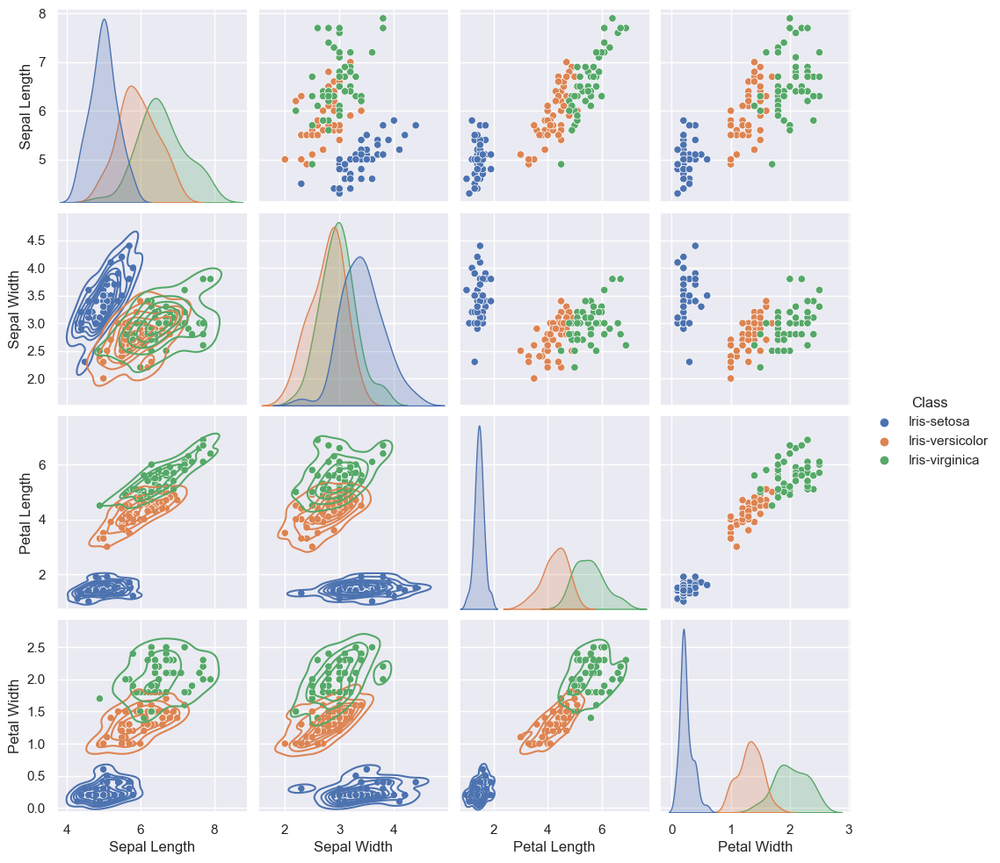

```python
import os
import glob
import pandas as pd
import numpy as np
import math
import matplotlib.pyplot as plt
import seaborn as sns
# Setting the ticks on the x and y axis
from matplotlib.ticker import (MultipleLocator, AutoMinorLocator)
from IPython.display import display
```


```python
summary_filename = "summary/summary_statistics.txt"
corr_filename = "summary/correlation.txt"
```


```python
# ************************ Function definitions ***************************
# Function to calculate the basic statistics of a dataset
def get_summary_stats(data, item=''):
    # Get the basic stats 
    summary_df = pd.DataFrame()
    summary_df['Min (cm)'] = data.min()
    summary_df['Max (cm)'] = data.max()
    summary_df['Mean (cm)'] = data.mean()
    summary_df['Median (cm)'] = data.median()
    summary_df['StDev (cm)'] = data.std()
    summary_df['Variance (cm)'] = data.var()
    
   
    return summary_df

# Function to write a summary of data to a file 
def write_to_file(summary_filename, df_data, heading, dec_format="%.2f"):   
    with open (summary_filename, 'at') as f:
        # to_string for nice formatting for the text file
        df_summary_asstr = df_data.to_string(float_format=dec_format, 
                                                justify='center')
        # write header and data 
        f.write(f'***************** {heading} *****************\n')
        f.write(f'{df_summary_asstr}\n')
        f.write('\n')

# Function to plot histograms of data 
def plot_histograms(data, var):   
        plt.figure()
        sns.histplot(data, x=var, hue="Class", binwidth=0.2, kde=True)
        plt.savefig(f'plots/histogram_{var}.png')  

# Run pandas correlation method
def get_corr(data):
    return data.corr()
# Styler for notebook table display
def my_styler(df, precision, caption):
    df_styler = df.style.format(precision=precision).set_caption(caption)
    return df_styler
def styler_highlight_between(df_styler, left, right):
    df_styler = df_styler.highlight_between(color='yellow', axis=0, left=left, right=right, inclusive='both', props=None) 
    return df_styler
```


```python
# ***************************** Reading in data ******************************
# Read in the data from the source file - no header  
data = pd.read_csv('data/iris.data', header=None)
# Make a list of the columns
variables = ["Sepal Length", "Sepal Width", "Petal Length",
             "Petal Width", "Class"]
# List of variables without class
variables_wo_class = variables[:-1]
# Assign the header to the data
data.columns = variables

# get the different classifications
class_names = data["Class"].unique()
# dataframe without class column
data_wo_class = data.drop(columns="Class").copy()
# Delete anything in summary directory
files = glob.glob('summary/*')
for f in files:
    os.remove(f)
    
# Get the statistics for the whole dataset and write to file
df_summary_all = get_summary_stats(data.drop(columns="Class"))
write_to_file(summary_filename, df_summary_all, "All data")
df_styler = my_styler(df_summary_all, 2, "Summary All")
summary_styler_list = [df_styler]
df_corr_all = get_corr(data)
write_to_file(corr_filename, df_corr_all, "All data", "%.3f")
#print("Title")
df_styler = my_styler(df_corr_all, 2, "Corellation All Data")
df_styler = styler_highlight_between(df_styler, 0.7, 0.99)
df_styler = styler_highlight_between(df_styler, -0.7, -0.99)
corr_styler_list = [df_styler]

corr_styler_list = [df_styler]
for item in class_names:
    # Extract the data related to one class of iris
    iris_data = data[data["Class"] == item].copy()
    # Strip the class column before passing to function
    iris_data.drop(columns = "Class", inplace=True) 
    # Get the stats and write to file
    df_summary = get_summary_stats(iris_data)
    df_styler_stats = my_styler(df_summary, 2, item+" Summary Statistics")
    summary_styler_list.append(df_styler_stats)   
    #   write_to_file(summary_filename, df_summary, item)
    df_corr =  get_corr(iris_data)      
  #  write_to_file(corr_filename, df_corr, item, "%.2f")
  #  df_styler = df_corr.style.format(precision=2).set_caption(item+" Correlation")
   # df_styler = df_styler.background_gradient(axis=None, vmin=0.75, vmax=0.99, cmap='YlOrRd')
    df_styler = my_styler(df_corr, 2, item+" Correlation")
    df_styler = styler_highlight_between(df_styler, 0.7, 0.99)
    df_styler = styler_highlight_between(df_styler, -0.7, -0.99)
    corr_styler_list.append(df_styler)
#    display(df_styler)
    
for item in summary_styler_list:
    display(item)

```


<style type="text/css">
</style>
<table id="T_26ffb">
  <caption>Summary All</caption>
  <thead>
    <tr>
      <th class="blank level0" >&nbsp;</th>
      <th id="T_26ffb_level0_col0" class="col_heading level0 col0" >Min (cm)</th>
      <th id="T_26ffb_level0_col1" class="col_heading level0 col1" >Max (cm)</th>
      <th id="T_26ffb_level0_col2" class="col_heading level0 col2" >Mean (cm)</th>
      <th id="T_26ffb_level0_col3" class="col_heading level0 col3" >Median (cm)</th>
      <th id="T_26ffb_level0_col4" class="col_heading level0 col4" >StDev (cm)</th>
      <th id="T_26ffb_level0_col5" class="col_heading level0 col5" >Variance (cm)</th>
    </tr>
  </thead>
  <tbody>
    <tr>
      <th id="T_26ffb_level0_row0" class="row_heading level0 row0" >Sepal Length</th>
      <td id="T_26ffb_row0_col0" class="data row0 col0" >4.30</td>
      <td id="T_26ffb_row0_col1" class="data row0 col1" >7.90</td>
      <td id="T_26ffb_row0_col2" class="data row0 col2" >5.84</td>
      <td id="T_26ffb_row0_col3" class="data row0 col3" >5.80</td>
      <td id="T_26ffb_row0_col4" class="data row0 col4" >0.83</td>
      <td id="T_26ffb_row0_col5" class="data row0 col5" >0.69</td>
    </tr>
    <tr>
      <th id="T_26ffb_level0_row1" class="row_heading level0 row1" >Sepal Width</th>
      <td id="T_26ffb_row1_col0" class="data row1 col0" >2.00</td>
      <td id="T_26ffb_row1_col1" class="data row1 col1" >4.40</td>
      <td id="T_26ffb_row1_col2" class="data row1 col2" >3.05</td>
      <td id="T_26ffb_row1_col3" class="data row1 col3" >3.00</td>
      <td id="T_26ffb_row1_col4" class="data row1 col4" >0.43</td>
      <td id="T_26ffb_row1_col5" class="data row1 col5" >0.19</td>
    </tr>
    <tr>
      <th id="T_26ffb_level0_row2" class="row_heading level0 row2" >Petal Length</th>
      <td id="T_26ffb_row2_col0" class="data row2 col0" >1.00</td>
      <td id="T_26ffb_row2_col1" class="data row2 col1" >6.90</td>
      <td id="T_26ffb_row2_col2" class="data row2 col2" >3.76</td>
      <td id="T_26ffb_row2_col3" class="data row2 col3" >4.35</td>
      <td id="T_26ffb_row2_col4" class="data row2 col4" >1.76</td>
      <td id="T_26ffb_row2_col5" class="data row2 col5" >3.11</td>
    </tr>
    <tr>
      <th id="T_26ffb_level0_row3" class="row_heading level0 row3" >Petal Width</th>
      <td id="T_26ffb_row3_col0" class="data row3 col0" >0.10</td>
      <td id="T_26ffb_row3_col1" class="data row3 col1" >2.50</td>
      <td id="T_26ffb_row3_col2" class="data row3 col2" >1.20</td>
      <td id="T_26ffb_row3_col3" class="data row3 col3" >1.30</td>
      <td id="T_26ffb_row3_col4" class="data row3 col4" >0.76</td>
      <td id="T_26ffb_row3_col5" class="data row3 col5" >0.58</td>
    </tr>
  </tbody>
</table>


<style type="text/css">
</style>
<table id="T_8888e">
  <caption>Iris-setosa Summary Statistics</caption>
  <thead>
    <tr>
      <th class="blank level0" >&nbsp;</th>
      <th id="T_8888e_level0_col0" class="col_heading level0 col0" >Min (cm)</th>
      <th id="T_8888e_level0_col1" class="col_heading level0 col1" >Max (cm)</th>
      <th id="T_8888e_level0_col2" class="col_heading level0 col2" >Mean (cm)</th>
      <th id="T_8888e_level0_col3" class="col_heading level0 col3" >Median (cm)</th>
      <th id="T_8888e_level0_col4" class="col_heading level0 col4" >StDev (cm)</th>
      <th id="T_8888e_level0_col5" class="col_heading level0 col5" >Variance (cm)</th>
    </tr>
  </thead>
  <tbody>
    <tr>
      <th id="T_8888e_level0_row0" class="row_heading level0 row0" >Sepal Length</th>
      <td id="T_8888e_row0_col0" class="data row0 col0" >4.30</td>
      <td id="T_8888e_row0_col1" class="data row0 col1" >5.80</td>
      <td id="T_8888e_row0_col2" class="data row0 col2" >5.01</td>
      <td id="T_8888e_row0_col3" class="data row0 col3" >5.00</td>
      <td id="T_8888e_row0_col4" class="data row0 col4" >0.35</td>
      <td id="T_8888e_row0_col5" class="data row0 col5" >0.12</td>
    </tr>
    <tr>
      <th id="T_8888e_level0_row1" class="row_heading level0 row1" >Sepal Width</th>
      <td id="T_8888e_row1_col0" class="data row1 col0" >2.30</td>
      <td id="T_8888e_row1_col1" class="data row1 col1" >4.40</td>
      <td id="T_8888e_row1_col2" class="data row1 col2" >3.42</td>
      <td id="T_8888e_row1_col3" class="data row1 col3" >3.40</td>
      <td id="T_8888e_row1_col4" class="data row1 col4" >0.38</td>
      <td id="T_8888e_row1_col5" class="data row1 col5" >0.15</td>
    </tr>
    <tr>
      <th id="T_8888e_level0_row2" class="row_heading level0 row2" >Petal Length</th>
      <td id="T_8888e_row2_col0" class="data row2 col0" >1.00</td>
      <td id="T_8888e_row2_col1" class="data row2 col1" >1.90</td>
      <td id="T_8888e_row2_col2" class="data row2 col2" >1.46</td>
      <td id="T_8888e_row2_col3" class="data row2 col3" >1.50</td>
      <td id="T_8888e_row2_col4" class="data row2 col4" >0.17</td>
      <td id="T_8888e_row2_col5" class="data row2 col5" >0.03</td>
    </tr>
    <tr>
      <th id="T_8888e_level0_row3" class="row_heading level0 row3" >Petal Width</th>
      <td id="T_8888e_row3_col0" class="data row3 col0" >0.10</td>
      <td id="T_8888e_row3_col1" class="data row3 col1" >0.60</td>
      <td id="T_8888e_row3_col2" class="data row3 col2" >0.24</td>
      <td id="T_8888e_row3_col3" class="data row3 col3" >0.20</td>
      <td id="T_8888e_row3_col4" class="data row3 col4" >0.11</td>
      <td id="T_8888e_row3_col5" class="data row3 col5" >0.01</td>
    </tr>
  </tbody>
</table>


<style type="text/css">
</style>
<table id="T_92afe">
  <caption>Iris-versicolor Summary Statistics</caption>
  <thead>
    <tr>
      <th class="blank level0" >&nbsp;</th>
      <th id="T_92afe_level0_col0" class="col_heading level0 col0" >Min (cm)</th>
      <th id="T_92afe_level0_col1" class="col_heading level0 col1" >Max (cm)</th>
      <th id="T_92afe_level0_col2" class="col_heading level0 col2" >Mean (cm)</th>
      <th id="T_92afe_level0_col3" class="col_heading level0 col3" >Median (cm)</th>
      <th id="T_92afe_level0_col4" class="col_heading level0 col4" >StDev (cm)</th>
      <th id="T_92afe_level0_col5" class="col_heading level0 col5" >Variance (cm)</th>
    </tr>
  </thead>
  <tbody>
    <tr>
      <th id="T_92afe_level0_row0" class="row_heading level0 row0" >Sepal Length</th>
      <td id="T_92afe_row0_col0" class="data row0 col0" >4.90</td>
      <td id="T_92afe_row0_col1" class="data row0 col1" >7.00</td>
      <td id="T_92afe_row0_col2" class="data row0 col2" >5.94</td>
      <td id="T_92afe_row0_col3" class="data row0 col3" >5.90</td>
      <td id="T_92afe_row0_col4" class="data row0 col4" >0.52</td>
      <td id="T_92afe_row0_col5" class="data row0 col5" >0.27</td>
    </tr>
    <tr>
      <th id="T_92afe_level0_row1" class="row_heading level0 row1" >Sepal Width</th>
      <td id="T_92afe_row1_col0" class="data row1 col0" >2.00</td>
      <td id="T_92afe_row1_col1" class="data row1 col1" >3.40</td>
      <td id="T_92afe_row1_col2" class="data row1 col2" >2.77</td>
      <td id="T_92afe_row1_col3" class="data row1 col3" >2.80</td>
      <td id="T_92afe_row1_col4" class="data row1 col4" >0.31</td>
      <td id="T_92afe_row1_col5" class="data row1 col5" >0.10</td>
    </tr>
    <tr>
      <th id="T_92afe_level0_row2" class="row_heading level0 row2" >Petal Length</th>
      <td id="T_92afe_row2_col0" class="data row2 col0" >3.00</td>
      <td id="T_92afe_row2_col1" class="data row2 col1" >5.10</td>
      <td id="T_92afe_row2_col2" class="data row2 col2" >4.26</td>
      <td id="T_92afe_row2_col3" class="data row2 col3" >4.35</td>
      <td id="T_92afe_row2_col4" class="data row2 col4" >0.47</td>
      <td id="T_92afe_row2_col5" class="data row2 col5" >0.22</td>
    </tr>
    <tr>
      <th id="T_92afe_level0_row3" class="row_heading level0 row3" >Petal Width</th>
      <td id="T_92afe_row3_col0" class="data row3 col0" >1.00</td>
      <td id="T_92afe_row3_col1" class="data row3 col1" >1.80</td>
      <td id="T_92afe_row3_col2" class="data row3 col2" >1.33</td>
      <td id="T_92afe_row3_col3" class="data row3 col3" >1.30</td>
      <td id="T_92afe_row3_col4" class="data row3 col4" >0.20</td>
      <td id="T_92afe_row3_col5" class="data row3 col5" >0.04</td>
    </tr>
  </tbody>
</table>


<style type="text/css">
</style>
<table id="T_078da">
  <caption>Iris-virginica Summary Statistics</caption>
  <thead>
    <tr>
      <th class="blank level0" >&nbsp;</th>
      <th id="T_078da_level0_col0" class="col_heading level0 col0" >Min (cm)</th>
      <th id="T_078da_level0_col1" class="col_heading level0 col1" >Max (cm)</th>
      <th id="T_078da_level0_col2" class="col_heading level0 col2" >Mean (cm)</th>
      <th id="T_078da_level0_col3" class="col_heading level0 col3" >Median (cm)</th>
      <th id="T_078da_level0_col4" class="col_heading level0 col4" >StDev (cm)</th>
      <th id="T_078da_level0_col5" class="col_heading level0 col5" >Variance (cm)</th>
    </tr>
  </thead>
  <tbody>
    <tr>
      <th id="T_078da_level0_row0" class="row_heading level0 row0" >Sepal Length</th>
      <td id="T_078da_row0_col0" class="data row0 col0" >4.90</td>
      <td id="T_078da_row0_col1" class="data row0 col1" >7.90</td>
      <td id="T_078da_row0_col2" class="data row0 col2" >6.59</td>
      <td id="T_078da_row0_col3" class="data row0 col3" >6.50</td>
      <td id="T_078da_row0_col4" class="data row0 col4" >0.64</td>
      <td id="T_078da_row0_col5" class="data row0 col5" >0.40</td>
    </tr>
    <tr>
      <th id="T_078da_level0_row1" class="row_heading level0 row1" >Sepal Width</th>
      <td id="T_078da_row1_col0" class="data row1 col0" >2.20</td>
      <td id="T_078da_row1_col1" class="data row1 col1" >3.80</td>
      <td id="T_078da_row1_col2" class="data row1 col2" >2.97</td>
      <td id="T_078da_row1_col3" class="data row1 col3" >3.00</td>
      <td id="T_078da_row1_col4" class="data row1 col4" >0.32</td>
      <td id="T_078da_row1_col5" class="data row1 col5" >0.10</td>
    </tr>
    <tr>
      <th id="T_078da_level0_row2" class="row_heading level0 row2" >Petal Length</th>
      <td id="T_078da_row2_col0" class="data row2 col0" >4.50</td>
      <td id="T_078da_row2_col1" class="data row2 col1" >6.90</td>
      <td id="T_078da_row2_col2" class="data row2 col2" >5.55</td>
      <td id="T_078da_row2_col3" class="data row2 col3" >5.55</td>
      <td id="T_078da_row2_col4" class="data row2 col4" >0.55</td>
      <td id="T_078da_row2_col5" class="data row2 col5" >0.30</td>
    </tr>
    <tr>
      <th id="T_078da_level0_row3" class="row_heading level0 row3" >Petal Width</th>
      <td id="T_078da_row3_col0" class="data row3 col0" >1.40</td>
      <td id="T_078da_row3_col1" class="data row3 col1" >2.50</td>
      <td id="T_078da_row3_col2" class="data row3 col2" >2.03</td>
      <td id="T_078da_row3_col3" class="data row3 col3" >2.00</td>
      <td id="T_078da_row3_col4" class="data row3 col4" >0.27</td>
      <td id="T_078da_row3_col5" class="data row3 col5" >0.08</td>
    </tr>
  </tbody>
</table>


```python
for item in corr_styler_list:
    display(item)
```


<style type="text/css">
#T_7b98f_row0_col2, #T_7b98f_row0_col3, #T_7b98f_row2_col0, #T_7b98f_row2_col3, #T_7b98f_row3_col0, #T_7b98f_row3_col2 {
  background-color: yellow;
}
</style>
<table id="T_7b98f">
  <caption>Corellation All Data</caption>
  <thead>
    <tr>
      <th class="blank level0" >&nbsp;</th>
      <th id="T_7b98f_level0_col0" class="col_heading level0 col0" >Sepal Length</th>
      <th id="T_7b98f_level0_col1" class="col_heading level0 col1" >Sepal Width</th>
      <th id="T_7b98f_level0_col2" class="col_heading level0 col2" >Petal Length</th>
      <th id="T_7b98f_level0_col3" class="col_heading level0 col3" >Petal Width</th>
    </tr>
  </thead>
  <tbody>
    <tr>
      <th id="T_7b98f_level0_row0" class="row_heading level0 row0" >Sepal Length</th>
      <td id="T_7b98f_row0_col0" class="data row0 col0" >1.00</td>
      <td id="T_7b98f_row0_col1" class="data row0 col1" >-0.11</td>
      <td id="T_7b98f_row0_col2" class="data row0 col2" >0.87</td>
      <td id="T_7b98f_row0_col3" class="data row0 col3" >0.82</td>
    </tr>
    <tr>
      <th id="T_7b98f_level0_row1" class="row_heading level0 row1" >Sepal Width</th>
      <td id="T_7b98f_row1_col0" class="data row1 col0" >-0.11</td>
      <td id="T_7b98f_row1_col1" class="data row1 col1" >1.00</td>
      <td id="T_7b98f_row1_col2" class="data row1 col2" >-0.42</td>
      <td id="T_7b98f_row1_col3" class="data row1 col3" >-0.36</td>
    </tr>
    <tr>
      <th id="T_7b98f_level0_row2" class="row_heading level0 row2" >Petal Length</th>
      <td id="T_7b98f_row2_col0" class="data row2 col0" >0.87</td>
      <td id="T_7b98f_row2_col1" class="data row2 col1" >-0.42</td>
      <td id="T_7b98f_row2_col2" class="data row2 col2" >1.00</td>
      <td id="T_7b98f_row2_col3" class="data row2 col3" >0.96</td>
    </tr>
    <tr>
      <th id="T_7b98f_level0_row3" class="row_heading level0 row3" >Petal Width</th>
      <td id="T_7b98f_row3_col0" class="data row3 col0" >0.82</td>
      <td id="T_7b98f_row3_col1" class="data row3 col1" >-0.36</td>
      <td id="T_7b98f_row3_col2" class="data row3 col2" >0.96</td>
      <td id="T_7b98f_row3_col3" class="data row3 col3" >1.00</td>
    </tr>
  </tbody>
</table>


<style type="text/css">
#T_6fc16_row0_col1, #T_6fc16_row1_col0 {
  background-color: yellow;
}
</style>
<table id="T_6fc16">
  <caption>Iris-setosa Correlation</caption>
  <thead>
    <tr>
      <th class="blank level0" >&nbsp;</th>
      <th id="T_6fc16_level0_col0" class="col_heading level0 col0" >Sepal Length</th>
      <th id="T_6fc16_level0_col1" class="col_heading level0 col1" >Sepal Width</th>
      <th id="T_6fc16_level0_col2" class="col_heading level0 col2" >Petal Length</th>
      <th id="T_6fc16_level0_col3" class="col_heading level0 col3" >Petal Width</th>
    </tr>
  </thead>
  <tbody>
    <tr>
      <th id="T_6fc16_level0_row0" class="row_heading level0 row0" >Sepal Length</th>
      <td id="T_6fc16_row0_col0" class="data row0 col0" >1.00</td>
      <td id="T_6fc16_row0_col1" class="data row0 col1" >0.75</td>
      <td id="T_6fc16_row0_col2" class="data row0 col2" >0.26</td>
      <td id="T_6fc16_row0_col3" class="data row0 col3" >0.28</td>
    </tr>
    <tr>
      <th id="T_6fc16_level0_row1" class="row_heading level0 row1" >Sepal Width</th>
      <td id="T_6fc16_row1_col0" class="data row1 col0" >0.75</td>
      <td id="T_6fc16_row1_col1" class="data row1 col1" >1.00</td>
      <td id="T_6fc16_row1_col2" class="data row1 col2" >0.18</td>
      <td id="T_6fc16_row1_col3" class="data row1 col3" >0.28</td>
    </tr>
    <tr>
      <th id="T_6fc16_level0_row2" class="row_heading level0 row2" >Petal Length</th>
      <td id="T_6fc16_row2_col0" class="data row2 col0" >0.26</td>
      <td id="T_6fc16_row2_col1" class="data row2 col1" >0.18</td>
      <td id="T_6fc16_row2_col2" class="data row2 col2" >1.00</td>
      <td id="T_6fc16_row2_col3" class="data row2 col3" >0.31</td>
    </tr>
    <tr>
      <th id="T_6fc16_level0_row3" class="row_heading level0 row3" >Petal Width</th>
      <td id="T_6fc16_row3_col0" class="data row3 col0" >0.28</td>
      <td id="T_6fc16_row3_col1" class="data row3 col1" >0.28</td>
      <td id="T_6fc16_row3_col2" class="data row3 col2" >0.31</td>
      <td id="T_6fc16_row3_col3" class="data row3 col3" >1.00</td>
    </tr>
  </tbody>
</table>


<style type="text/css">
#T_6f7ec_row0_col2, #T_6f7ec_row2_col0, #T_6f7ec_row2_col3, #T_6f7ec_row3_col2 {
  background-color: yellow;
}
</style>
<table id="T_6f7ec">
  <caption>Iris-versicolor Correlation</caption>
  <thead>
    <tr>
      <th class="blank level0" >&nbsp;</th>
      <th id="T_6f7ec_level0_col0" class="col_heading level0 col0" >Sepal Length</th>
      <th id="T_6f7ec_level0_col1" class="col_heading level0 col1" >Sepal Width</th>
      <th id="T_6f7ec_level0_col2" class="col_heading level0 col2" >Petal Length</th>
      <th id="T_6f7ec_level0_col3" class="col_heading level0 col3" >Petal Width</th>
    </tr>
  </thead>
  <tbody>
    <tr>
      <th id="T_6f7ec_level0_row0" class="row_heading level0 row0" >Sepal Length</th>
      <td id="T_6f7ec_row0_col0" class="data row0 col0" >1.00</td>
      <td id="T_6f7ec_row0_col1" class="data row0 col1" >0.53</td>
      <td id="T_6f7ec_row0_col2" class="data row0 col2" >0.75</td>
      <td id="T_6f7ec_row0_col3" class="data row0 col3" >0.55</td>
    </tr>
    <tr>
      <th id="T_6f7ec_level0_row1" class="row_heading level0 row1" >Sepal Width</th>
      <td id="T_6f7ec_row1_col0" class="data row1 col0" >0.53</td>
      <td id="T_6f7ec_row1_col1" class="data row1 col1" >1.00</td>
      <td id="T_6f7ec_row1_col2" class="data row1 col2" >0.56</td>
      <td id="T_6f7ec_row1_col3" class="data row1 col3" >0.66</td>
    </tr>
    <tr>
      <th id="T_6f7ec_level0_row2" class="row_heading level0 row2" >Petal Length</th>
      <td id="T_6f7ec_row2_col0" class="data row2 col0" >0.75</td>
      <td id="T_6f7ec_row2_col1" class="data row2 col1" >0.56</td>
      <td id="T_6f7ec_row2_col2" class="data row2 col2" >1.00</td>
      <td id="T_6f7ec_row2_col3" class="data row2 col3" >0.79</td>
    </tr>
    <tr>
      <th id="T_6f7ec_level0_row3" class="row_heading level0 row3" >Petal Width</th>
      <td id="T_6f7ec_row3_col0" class="data row3 col0" >0.55</td>
      <td id="T_6f7ec_row3_col1" class="data row3 col1" >0.66</td>
      <td id="T_6f7ec_row3_col2" class="data row3 col2" >0.79</td>
      <td id="T_6f7ec_row3_col3" class="data row3 col3" >1.00</td>
    </tr>
  </tbody>
</table>


<style type="text/css">
#T_cc659_row0_col2, #T_cc659_row2_col0 {
  background-color: yellow;
}
</style>
<table id="T_cc659">
  <caption>Iris-virginica Correlation</caption>
  <thead>
    <tr>
      <th class="blank level0" >&nbsp;</th>
      <th id="T_cc659_level0_col0" class="col_heading level0 col0" >Sepal Length</th>
      <th id="T_cc659_level0_col1" class="col_heading level0 col1" >Sepal Width</th>
      <th id="T_cc659_level0_col2" class="col_heading level0 col2" >Petal Length</th>
      <th id="T_cc659_level0_col3" class="col_heading level0 col3" >Petal Width</th>
    </tr>
  </thead>
  <tbody>
    <tr>
      <th id="T_cc659_level0_row0" class="row_heading level0 row0" >Sepal Length</th>
      <td id="T_cc659_row0_col0" class="data row0 col0" >1.00</td>
      <td id="T_cc659_row0_col1" class="data row0 col1" >0.46</td>
      <td id="T_cc659_row0_col2" class="data row0 col2" >0.86</td>
      <td id="T_cc659_row0_col3" class="data row0 col3" >0.28</td>
    </tr>
    <tr>
      <th id="T_cc659_level0_row1" class="row_heading level0 row1" >Sepal Width</th>
      <td id="T_cc659_row1_col0" class="data row1 col0" >0.46</td>
      <td id="T_cc659_row1_col1" class="data row1 col1" >1.00</td>
      <td id="T_cc659_row1_col2" class="data row1 col2" >0.40</td>
      <td id="T_cc659_row1_col3" class="data row1 col3" >0.54</td>
    </tr>
    <tr>
      <th id="T_cc659_level0_row2" class="row_heading level0 row2" >Petal Length</th>
      <td id="T_cc659_row2_col0" class="data row2 col0" >0.86</td>
      <td id="T_cc659_row2_col1" class="data row2 col1" >0.40</td>
      <td id="T_cc659_row2_col2" class="data row2 col2" >1.00</td>
      <td id="T_cc659_row2_col3" class="data row2 col3" >0.32</td>
    </tr>
    <tr>
      <th id="T_cc659_level0_row3" class="row_heading level0 row3" >Petal Width</th>
      <td id="T_cc659_row3_col0" class="data row3 col0" >0.28</td>
      <td id="T_cc659_row3_col1" class="data row3 col1" >0.54</td>
      <td id="T_cc659_row3_col2" class="data row3 col2" >0.32</td>
      <td id="T_cc659_row3_col3" class="data row3 col3" >1.00</td>
    </tr>
  </tbody>
</table>


```python
sns.set_theme()
g = sns.pairplot(data, hue="Class", diag_kind="kde")
g.map_lower(sns.kdeplot, levels=7, color=".2")
plt.show()
#g.savefig("plots/pairplot.png")
```


    

    


    

    


    

    


    

    


    

    


    

    


    

    


    

    


    

    


```python

```
